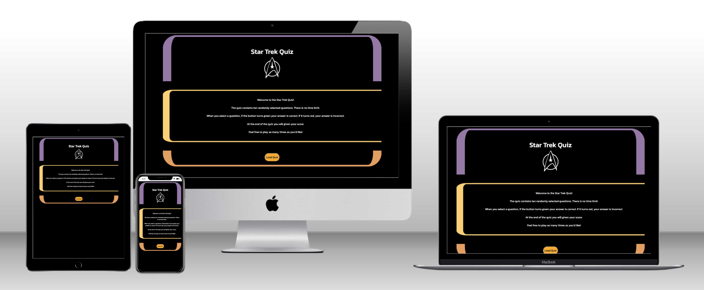
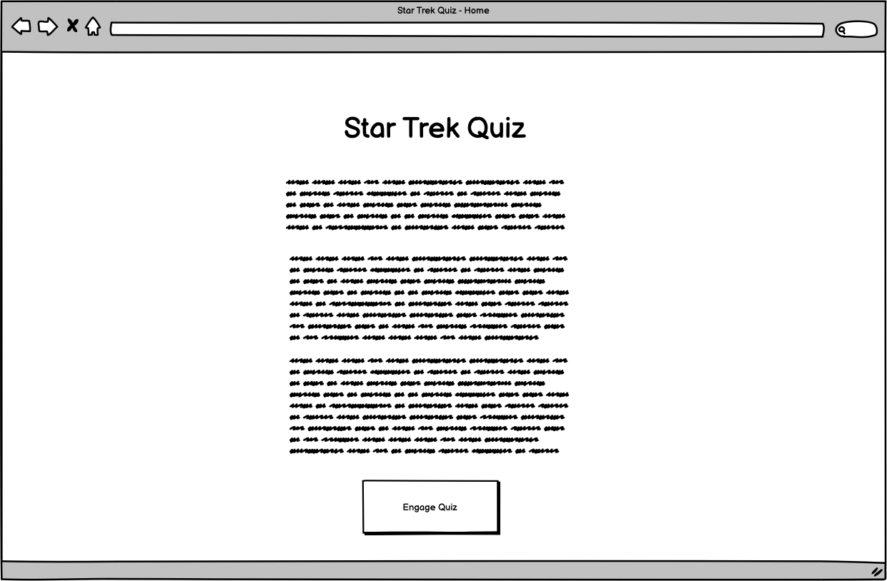
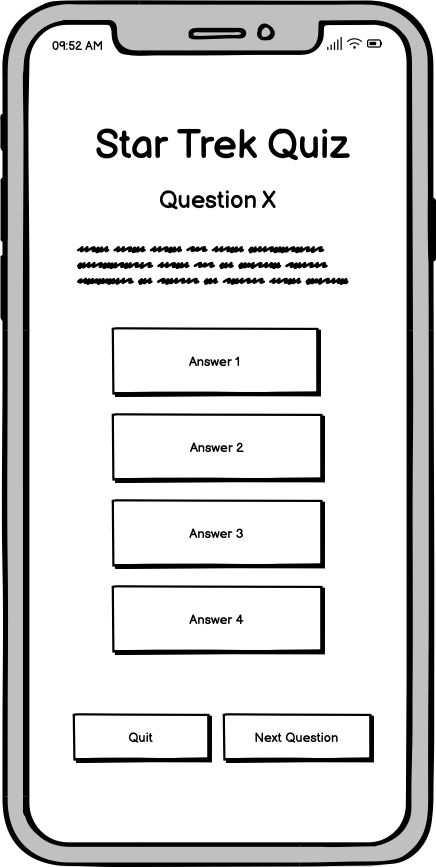
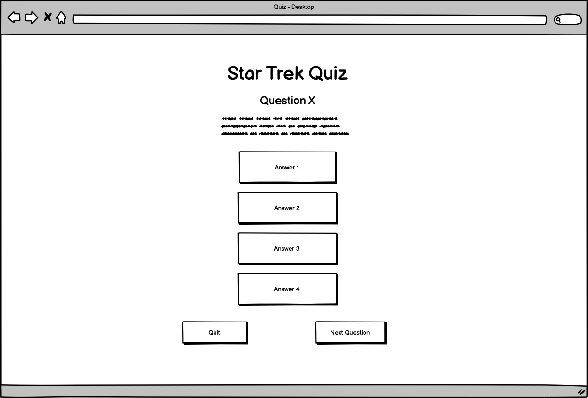

# Milestone Project 2 - Star Trek Quiz 

## Purpose

This website was created for Code Institute's Milestone Project 2 assignment. The purpose of the project is to demonstrate an understanding and practical application of Javascript. It also puts into practice knowledge and techniques learned so far on the Full Stack Development course. A full list of technologies used can be found of in the technologies section of this document. 

The live website can be found [here](https://siondawson.github.io/milestone-project-2/index.html)

## Star Trek Quiz Responsive Website

The project is a quiz based on Star Trek and is intented as a fun game for users. Users will be presented with a series of ten question, each with four possible answer to choose from. 

# User Experience Design

## User Stories

### First Time Visitor Stories

#### As a first time user, I want:

1. To be able to easily understand the purpose of the site.
2. To be able to play the quiz right away, without needing any instruction.
3. To test my knowledge about Star Trek.
4. To know many many questions I got right.
5. To view the site on any device.

#### As a returning user, I want:

1. To play the quiz again. 
2. To improve my score. 

#### As a frequent user, I want:

1. To master the quiz.
2. See if any new questions have been added.
3. Get a perfect score.

# Structure 

## Bootstrap

Bootstrap 5 was used to structure the website. The sites layout is fairly simple this was put into place first. A mobile first apporach was used where the sites layour was first imagined for mobile screens and scaled up for larger screens. The required elements were few enough that the sites appearence is mainly the small on all screen sizes. 

## Home Page

Only a simple home page will be required. The user will be presented with the LCARS style panel along with a Starfleet badge and instructions on how to play the quiz. Underneath this there will be a button to take the user to the quiz. 

## Quiz - user interface

On page load the user will see the layout of the quiz. They will need to click a button at the bottom to begin the quiz. Once clicked the user will be presented with the first question. The user will not be able to skip to the next question until an answer is selected. Once an answer is selected the selection will turn green if correct or red if incorrect. The user will not be able to change their answer once a selection has been made. 

Once a selection has been made the next question button will be enabled and user will be able to move on to the next quesiton. 

A button allowing the user to quit the quiz to the homepage will be visible at all times. 

# Design

This projects visual design is farily simple. The purpose of the project is to demonstrate understanding of Javascript therefore the bulk of the work went into the st-quiz.js file. 

## Appearence

In order to present the user with an experience in keeping with the look and feel of Star Trek, I wanted the CSS to emulate the look of the computer panels in the show. In preperation for this project I disvered a CSS template to achieve this. This was modified for my own needs as is as presented in the project. 

## Color scheme 

The colors we're used from those identified in [this github repository](https://github.com/frohoff/ctfd-trektheme). Three colors were chosen for the main 'LCARS' panels, the rest were put into array that allowed their random application to the answer buttons each time a new question is loaded. Darker colors which caused contrast issues we're removed. 

## 'LCARS' Panels 

Library Computer Access/ Retrieval System (LCARS). Fictional computer system designed by Michael Okuda which first appeared in Star Trek: The Next Generation.

Using the above github repository I studied the use of divs and CSS borders to achieve the 'LCARS' style look and modified for my own use. I created four seperate classes within style.css which could be applied to an outer div to create the desired look.  

## Quiz - design

The quiz itself will consist of ten questions drawn from a possible 21. The quiz will randomly select these question from four seperate arrays:

1. easyQuestions (6 objects)
2. mediumQuestions (6 objects)
3. hardQuestions (6 objects)
4. bonusQuestions (3 objects)

Three questions each will be selected from easy, medium and hard questions. One from the bonus questions. This approach presents the user with a different quiz each time.

This approach will allow for quiz questions to be modfied, changed or expanded on without needing to modify the functionality of the quiz itself. 

In any changes or new questions it must be ensured that the string 'correct' exactly matches the correct answer in the list of 'options' for the quiz to function correctly.   

## Images

Images we're pulled from various google searches. The starfleet badge image was taken from the above references github repository. 

## Wireframes

## Differences to design

* Wireframes show only most basic layout of the website needed to achieve intended functionality. 

* The CSS 'LCARS' look was implemented following creating the wireframes. 

* On beginning building the quiz, it quickly became evident that user experience would be greatly improved with some images to accompany each question. 

* 'Engage Quiz' button was moved to quiz.html so that all Javascript functionality is contained to quiz.html. 

* As 'Engage Quiz' button was moved to quiz.html placeholder text was added to question and buttons prompting user to click 'engage quiz' button.

* Custom 404 error page - added on advice of my mentor. No wireframes needed for this. CSS styling allready in place.

# Technologies 

* HTML
    + HTML was used to complete the structure of the website.
* CSS 
    + CSS was used to style the website.
* Bootstrap 5
    + Bootstrap 5 was used to responsively structure the website.
* Javascript
    + Javascript was used to display quiz questions and calculate the users score. 
* Techsini
    + Used to create apple device mockup for readme.
+ favicon.io
    + Used to create multi device mockup for this readme.

# Testing 

This project is an interactive website. Testing will be performed on: 

1. The websites visual appearance accross all screen sizes.
2. Navigation buttons behave as expected.
3. Javascript functionality.

Extensive manual testing of Javascript functionality was carried out at all stages of development. 

## First time user stories: 

### High level tests against user stories

#### First time user stories:

1. To be able to easily understand the purpose of the site.
    + All content displaus correctly on all screen sizes.
2. To be able to play the quiz right away, without needing any instruction.
    + Simple nav buttons and start quiz buttons allow user to begin the quiz without reading instructions on homepage. Quiz buttons use are obvious to first time user. 
3. To test my knowledge about Star Trek.
    + Quiz functions as expected. No technical barriers to user answering quiz questions exist.
4. To know many many questions I got right.
    + Score displays correctly after 10th question has been answered.
5. To view the site on any device.
    + Site tested from 300 - 3000px in google developer tools to ensure correct layout. Website also tested on many devices amongs immediate friends and family. 
    + Extensive manual testing/ proof reading as questions were created to ensure 'correct' string matches the correct 'option' string.

#### Returning user stories

1. To play the quiz again. 
    + Website tested to ensure a new array of questions formed and score reset to zero.
2. To improve my score.
    + When incorrect answers are selected, the user is not given the correct answer. They must rely on their knowlege alone!

#### Frequent user stories

1. To master the quiz.
    + Ensure quiz functions perfectly. Leaving no chance for correct answer to be selected and 'incorrect' result being given.
2. See if any new questions have been added. 
    + Quiz built in a way where new questions can be added easily (with care and attention to detail) to question arrays.  
2. Get a perfect score.
    + Ensure quiz functions correctly. Ensure score is calculated correctly and displays correctly at the end of the quiz.

## Issues found during testing 

1. Score should increment by 1 for each correct answer. In project midpoint meeting my mentor identified issue where score would increment by 2 for each correct question after user clicked 'play again' button. This problem persisted into incrementing by 3 in the 3rd round. Issue remains in code. 

+ Issue bypassed by calling location.reload() on clicking 'play again' button. 

+ Result is user must click 'engage!' button again to play another round of the quiz. This does not adversely effect user experience.

2. Questions checking answers against next question. Unsure why this was happening. Issue resolved by checking answer against previous index of array (questionNumber -1).

3. Randomly applied answer button colors may duplicate and apply same color to more than one button. Does not effect functionality but flagged as detrimental to user experience. 

4. Next Question/ Quit/ Play again buttons need resizing. Some overlapping happening on smallest screen sizes.

# Deployment

This project was created using the code institute template.

## Version Control

This project was created using Visual Studio Code editor and pushed to 'milestone-project-2-sion-dawson', a remote repository in github.

Throughout the project these commands were used to save work and push changes to github via the command line terminal.

1. Type: git add .
    + This command adds files to the staging area before committing.
2. Type: git commit -m "a message goes in here explaining what chanes were made"
    + This command commits changes to the local repository
3. Type: git push
    + This command commits all changes to the remote GitHub repository.

## Deployment to github pages

1. Navigate to this projects [github repository](https://github.com/siondawson/milestone-project-2/tree/main)
2. Click 'settings' tab.
3. Scroll down to the git hub pages heading.
4. Select 'master branch' as the source.
5. Click the save button.
6. Click on the link to go to the live deployed page.

## Clone the repository to your machine

Navigate to the [github repository](https://github.com/siondawson/milestone-project-2/tree/main)

1. Click on the code drop down button.
2. Click HTTPS
3. Copy repository link
4. Open your IDE (git must be installed)
5. Type git clone (copied git url) into the terminal.

The project will now have been cloned on your machine.

## Credits

The code content of this software was created by Sion Dawson. 

## Media 

Question images have been taken from various sources on google searches. Links to images sources have been included in st-quiz.js as inline comments next to image properties in question arrays.

Starfleet insignia image was included in allready referenced [github repoistory](https://github.com/frohoff/ctfd-trektheme) on creating lcars style css theme. 

## Acknowledgement

Thankyou to my tutor Daisy McGirr for her help and guidance in this project. Thanks also to my wife Samantha (code institute alumni) for helping me overcome problems and discussing ideas.

